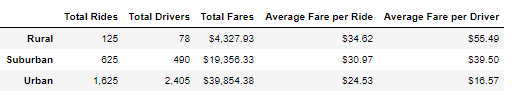
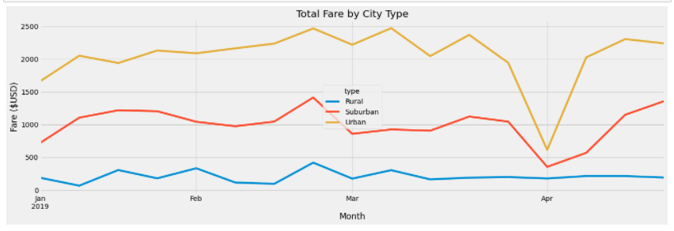

# **PyBer_Analysis**

## **Analysis Overview**

### **Purpose**

creating summary data frame and visualizations to show how data differ by city type to help decision makers at PyBer make infomred decisions.

### **Results**

### **Summary**

we notice that we have much less drivers in rural areas than we have in suburban and urban cities.Therefore, I recommend to develop more incentives to attract more drivers in rural cities which should also help in bringin fare prices down in rural areas. I also recommend adopting a more green policy and have more hybrid or even full electiric vehicles which should attract more enviromental focused clients and help bring  fares down in the long run. Since Urban cities are the biggest revenue generators we will need to attract more drivers so we do not lose our market share.

